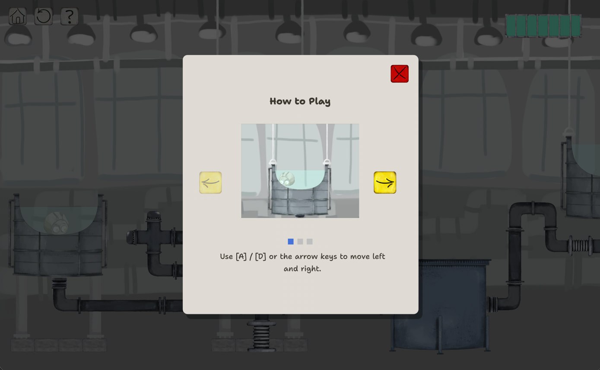
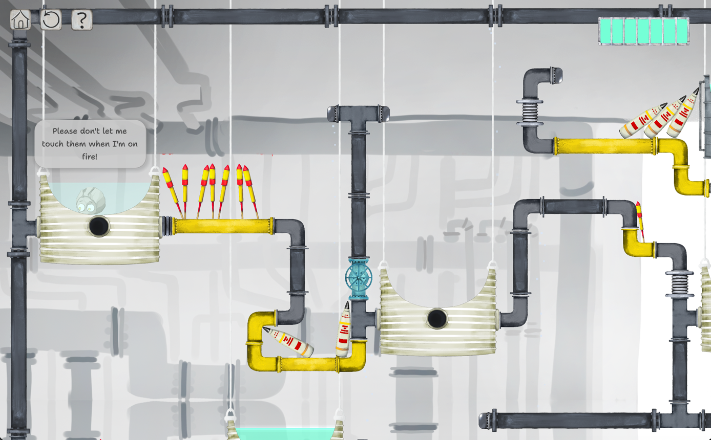

# White Phosphorus: An Explosive Escape

A web-based small 2D platformer about a phosphorus character who survives in water, burns in air, and uncovers strange facts about phosphorus along the way.  Built with [Godot 4.6](https://godotengine.org/) using GDScript.

### Play it on: [Itch.io](https://kaeri-gg.itch.io/white-phosphorus-an-explosive-escape)


---

## Table of Contents

- [About the Game](#about-the-game)
- [Academic Context](#academic-context)
- [Educational Goal](#educational-goal)
- [Features](#features)
- [Screenshots](#screenshots)
- [Controls](#controls)
- [Project Structure](#project-structure)
- [Getting Started](#getting-started)
  - [Prerequisites](#prerequisites)
  - [Running the Project](#running-the-project)
- [Building the Game](#building-the-game)
  - [Web Build (HTML5)](#web-build-html5)
- [License](#license)
- [Credits](#credits)

---

## About the Game

White phosphorus is a real chemical element that ignites on contact with air and must be stored under water to remain stable. *White Phosphorus: An Explosive Escape* turns that quirk into a platforming mechanic: the player must stay close to water to survive while navigating obstacles and hazards. Between levels, short fact scenes share real-world chemistry trivia about phosphorus.

## Academic Context

This game is an **educational university final project** developed for the course **Learning Game Development** at **Tallinn University (Tallinna Ülikool), Estonia**.

## Educational Goal

This game was created as a safe and enjoyable way for students and players to learn about phosphorus. Through a light and interactive experience, we hope this game sparks curiosity and builds understanding in a way that feels both educational and fun.

## Features

- Four hand-crafted platformer levels
- Fact scenes covering real phosphorus chemistry
- Water-based health system inspired by the element's actual properties
- Splash screen, tutorial, dialogs, and full UI flow

## Screenshots





## Controls

| Action        | Keys                |
|---------------|---------------------|
| Move Left     | `A` / `←`           |
| Move Right    | `D` / `→`           |
| Jump          | `Space` / `W` / `↑` |
| Double Jump   | 2x `Space` / `W` / `↑` |
| Interact      | `E`                 |
| Help          | `H`                 |
| Restart Level | `R`                 |
| Back to Home  | `B`                 |
| Settings      | `Esc`               |

## Project Structure

```
.
├── assets/              # Art, audio, fonts, backgrounds, tutorial video
├── scenes/
│   ├── components/      # Reusable scene fragments
│   ├── facts-scenes/    # Inter-level "phosphorus fact" scenes
│   ├── levels/          # level_01 … level_04
│   ├── ui/              # Menus, dialogs, splash, HUD
│   └── utils/           # Utility scenes
├── scripts/
│   ├── components/      # Component-level logic
│   ├── levels/          # Per-level scripts
│   ├── managers/        # Autoloaded singletons (utils, sound, music, UI)
│   ├── shaders/         # Custom shaders
│   └── ui/              # UI scripts
├── theme/               # Godot theme resources
├── addons/              # Godot plugins
├── project.godot        # Godot project file
├── export_presets.cfg   # Export configuration (Web preset)
└── LICENSE
```

## Getting Started

### Prerequisites

- [Godot Engine **4.6**](https://godotengine.org/download) (Standard or .NET — Standard is sufficient since the project uses GDScript)
- Git

### Running the Project

```bash
git clone https://github.com/kaeri-gg/white-phosphorus-an-explosive-escape.git
cd white-phosphorus-an-explosive-escape
```

1. Open the [Godot Engine](https://godotengine.org/).
2. Click **Import**, navigate to the cloned folder, and select `project.godot`.
3. Once the project loads, press **F5** (or the ▶ button) to run.

## Building the Game

The project ships with a pre-configured **Web** export preset that outputs to `release/index.html`.

### Web Build (HTML5)

1. In the Godot editor, open **Project → Export…**.
2. The preset `White Phosphorus: An Explosive Escape (Web)` is already set up.
3. If prompted, install the matching **Export Templates** for Godot 4.6 (**Editor → Manage Export Templates…**).
4. Click **Export Project…**, choose an output folder (e.g. `release/`), and uncheck **Export With Debug** for a production build.
5. Godot will produce `index.html`, `.wasm`, `.pck`, and supporting files.

You can also export from the command line:

```bash
godot --headless --export-release "White Phosphorus: An Explosive Escape" release/index.html
```

> The web build requires the page to be served over HTTP(S) with cross-origin isolation headers (`Cross-Origin-Opener-Policy: same-origin`, `Cross-Origin-Embedder-Policy: require-corp`). Opening `index.html` directly from the filesystem will not work.

For local testing:

```bash
cd release
python3 -m http.server 8000
# Visit http://localhost:8000
```

## License

This project is licensed under the **MIT License**.

---

## Credits

### Game Designers

- Anna Arsenina, Ai Dinh, Liu Qianying, Kathleen Povadora

### Game Art

- **Lead Artist**: Anna Arsenina
- **UI/UX**: Kathleen Povadora

### Level Design

- **Lead Designer**: Anna Arsenina
- **Contributor**: Liu Qianying

### Game Development

- **Lead Developer**: Kathleen Povadora
- **Contributor**: Ai Dinh

### Sounds Management

- **Lead Manager**: Kathleen Povadora
- **Contributors**: Anna Arsenina, Liu Qianying

### Narrative

- **Lead**: Liu Qianying
- **Contributor**: Anna Arsenina

### Producer

- Ai Dinh

### Special Thanks

A heartfelt thank you to all our classmates and friends who generously gave their free time to play test the game and share their feedback. Your input helped shape and improve it greatly. This game is supervised by Mikhail Fiadotau and Leonardo Sorrentino.

### Background Music

- **Boogie** by [Pecan Pie](https://uppbeat.io/browse/artist/pecan-pie) from [Uppbeat](https://uppbeat.io/)

### Sound Effects

- **Game Over** by [Alphix](https://pixabay.com/users/alphix-52619918/?utm_source=link-attribution&utm_medium=referral&utm_campaign=music&utm_content=417465) from [Pixabay](https://pixabay.com/?utm_source=link-attribution&utm_medium=referral&utm_campaign=music&utm_content=417465)
- **Portal Sound** by [Koi Roylers](https://pixabay.com/users/koiroylers-44305058/?utm_source=link-attribution&utm_medium=referral&utm_campaign=music&utm_content=355980) from [Pixabay](https://pixabay.com/sound-effects/?utm_source=link-attribution&utm_medium=referral&utm_campaign=music&utm_content=355980)
- **Enter Water** by [Jurij](https://pixabay.com/users/soundreality-31074404/?utm_source=link-attribution&utm_medium=referral&utm_campaign=music&utm_content=424583) from [Pixabay](https://pixabay.com/?utm_source=link-attribution&utm_medium=referral&utm_campaign=music&utm_content=424583)
- **Show Dialog** by [Universfield](https://pixabay.com/users/universfield-28281460/?utm_source=link-attribution&utm_medium=referral&utm_campaign=music&utm_content=320977) from [Pixabay](https://pixabay.com/?utm_source=link-attribution&utm_medium=referral&utm_campaign=music&utm_content=320977)
- **Damage** by [freesound_community](https://pixabay.com/users/freesound_community-46691455/?utm_source=link-attribution&utm_medium=referral&utm_campaign=music&utm_content=90398) from [Pixabay](https://pixabay.com/sound-effects/?utm_source=link-attribution&utm_medium=referral&utm_campaign=music&utm_content=90398)
- **Enter Game** by [floraphonic](https://pixabay.com/users/floraphonic-38928062/?utm_source=link-attribution&utm_medium=referral&utm_campaign=music&utm_content=189853) from [Pixabay](https://pixabay.com/sound-effects/?utm_source=link-attribution&utm_medium=referral&utm_campaign=music&utm_content=189853)
- **Winning** by [freesound_community](https://pixabay.com/users/freesound_community-46691455/?utm_source=link-attribution&utm_medium=referral&utm_campaign=music&utm_content=96336) from [Pixabay](https://pixabay.com/?utm_source=link-attribution&utm_medium=referral&utm_campaign=music&utm_content=96336)
- **Game Win Fast Organ Fanfare** from [Uppbeat](https://uppbeat.io/sfx/game-win-fast-organ-fanfare/169013/64386)
- **Fireworks 1** by [freekit](https://freesound.org/people/freekit/) from [Freesound](https://freesound.org/people/freekit/sounds/843947/)
- **8bit Jump** by [plasterbrain](https://freesound.org/people/plasterbrain/) from [Freesound](https://freesound.org/people/plasterbrain/sounds/399095/) 
- **Bonfire Being Lit** by [samararaine](https://freesound.org/people/samararaine/) from [Freesound](https://freesound.org/people/samararaine/sounds/186374/)
- **Heal** by [ZeltBolt](https://freesound.org/people/zeltbolt/) from [Freesound](https://freesound.org/people/zeltbolt/sounds/833035/) 
- **Other sound** by [brunoboselli](https://freesound.org/people/brunoboselli/) from [Freesound](https://freesound.org/)
- **Other sound** by [Robinhood76](https://freesound.org/people/Robinhood76/) from [Freesound](https://freesound.org/)
- **Other sound** by [RutgerMuller](https://freesound.org/people/RutgerMuller/) from [Freesound](https://freesound.org/) 
